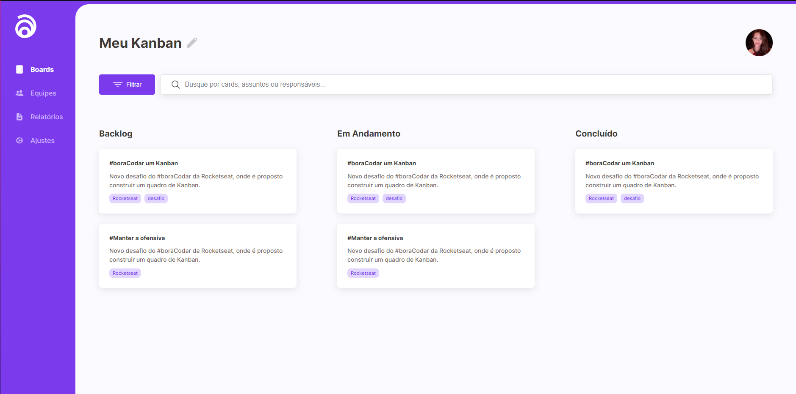

<h1 align="center"> 
	Gestão de Tarefas (Kanban) 🚀
</h1>

<h4 align="center">
    
</h4>

## 💻 Sobre o projeto

Meu Kanban - Projeto de um Kanban para gestão de tarefas, onde é possível arrastar tarefas entre as etapas de cada uma, bem como realizar filtros e buscas a fim de facilitar a experiência do usuário. Inspirado em plataformas conhecidas no mercado como Jira, Trello, Asana, entre outros.

Layout de Projeto e HTML e CSS fornecidos pela [Rocketseat] pelo programa #boraCodar.
A partir dessa base, propus a utilização do framework React e também algumas funcionalidades para enriquecer o projeto. 

## 🎨 Layout

O layout da aplicação está disponível no Figma:

---

## ⚙️ Funcionalidades (disponibilizadas pela Rocketseat)

- [x] Layout do FIGMA com o protótipo da tela.
- [x] Criação de todo o HTML e CSS da página exatamente de acordo com o disponibilizado no Figma, incluíndo ícones e avatar.
- [x] Não foi utilizado Javascript, nem nenhum tipo de framework.

---

## ⚙️ Funcionalidades Futuras

- [x] Adaptar todo o código inicial para utilizar o framework React (com Vite).
- [ ] Implementar o funcionamento do botão de filtragem dos cards
- [ ] Implementar o funcionamento do botão de search 
- [ ] Implementar a funcionalidade de Drag and Drop para que seja possível arrastar os cards entre as raias.
- [x] Implementar o botão de adicionar tarefas, permitindo que o usuário consiga colocar um titulo de forma rápida.
- [x] Implementar uma pequena mensagem de erro para o usuário caso ele não adicione um titulo para sua tarefa.
- [x] Implementar o ícone de lixeiras em cada card com a lógica para remover cards.
- [ ] Implementar a parte de detalhamento dos Cards, com as seguintes informações:
    - Título
    - Data de Solicitação
    - Responsável
    - Descrição
    - Opção de marcar como Concluído
    - Adicionar Subtarefas
    - Comentários
- [ ] Utilização do Firebase para compor o backend da aplicação
- [ ] Mudança da biblioteca ion icon para React Icons

---

## 📝 Licença

Este projeto esta sobe a licença [MIT](./LICENSE).

Feito por Jessica Monique (pode chamar de Monique 👋🏽) | 
[Linkedin](https://www.linkedin.com/in/jmoniquemelo/)

---

